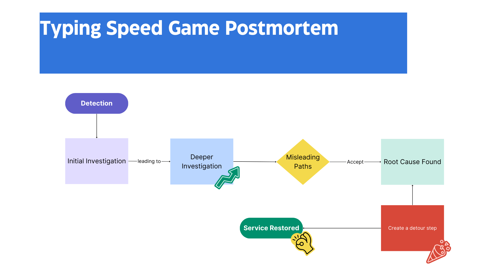

# Typing Speed Game Postmortem

## Overview

This README.md file documents the postmortem analysis of an incident that occurred during the operation of the Typing Speed Game project. It provides a detailed account of the issue, its impact, root cause analysis, resolution steps, and corrective measures taken to prevent future occurrences.

---

## Diagram

---

## Issue Summary

## A visual representation of our data's journey to oblivion.

**Duration of the Outage:**
Start Time: July 15, 2024, 10:00 AM UTC  
End Time: July 15, 2024, 2:00 PM UTC

**Impact:**
- **Service Down:** Typing Speed Test Game
- **User Experience:** Users experienced loss of their progress, including scores and levels. The game displayed incomplete or inaccurate information.
- **Affected Users:** Approximately 80% of users were affected by the data loss.

---

## Timeline

## A timeline of our roller-coaster journey.

- **10:00 AM UTC:** Issue detected via automated monitoring alert indicating a sudden drop in user data retrieval success rates.
- **10:05 AM UTC:** On-call engineer begins investigating the alert and notices anomalies in the database logs.
- **10:15 AM UTC:** Initial hypothesis formed that there may be a connectivity issue between the application and the database.
- **10:30 AM UTC:** Further investigation reveals that the issue is not related to connectivity, prompting a deeper dive into the database itself.
- **11:00 AM UTC:** Engineers identify signs of data corruption in the database, likely linked to a recent schema change.
- **11:15 AM UTC:** Incident escalated to the database administration team for specialized investigation and resolution.
- **11:45 AM UTC:** Misleading debugging paths followed, including checking for hardware failures and network issues, are ruled out.
- **12:30 PM UTC:** Database administrators confirm the corruption and identify a misconfigured backup process as a contributing factor.
- **1:00 PM UTC:** Decision made to restore from the last known good backup while addressing the misconfiguration.
- **1:30 PM UTC:** Backup restoration process initiated, estimated to take approximately 30 minutes.
- **2:00 PM UTC:** Backup restoration completed, and normal service is resumed. Users are notified of the resolution and potential data loss.

---

## Root Cause and Resolution

## How we dug ourselves out of a data hole.

### Root Cause:
The root cause of the outage was a combination of a misconfigured backup process and a recent change to the database schema. The schema change, intended to optimize data retrieval performance, inadvertently introduced inconsistencies in the data storage format. This misconfiguration went unnoticed due to inadequate testing and monitoring of the backup process, leading to corruption of user data.

### Resolution:
- **Detection and Escalation:** Automated monitoring systems detected a sudden drop in data retrieval success rates, prompting an investigation.
- **Investigation and Analysis:** Database administrators identified data corruption linked to the schema change and misconfigured backup.
- **Immediate Action:** Data restoration from the last known good backup was initiated, preventing further data loss.
- **User Communication:** Users were promptly informed about the incident, steps taken for resolution, and potential data loss during the affected period.

---

## Corrective and Preventative Measures

## Steps to a more resilient future.

### Areas for Improvement:
- **Backup Process Configuration and Monitoring:** Ensure proper configuration and testing of backup systems.
- **Database Schema Changes:** Implement rigorous testing and validation protocols for schema changes.
- **Data Integrity Verification:** Develop tools for regular data integrity checks and audits.
- **Team Training:** Conduct training on best practices for backup, monitoring, and schema management.

### Specific Tasks:
- Patch backup system configuration.
- Enhance monitoring with advanced tools.
- Establish protocols for schema change testing.
- Schedule regular data audits and integrity checks.
- Conduct team training sessions on new protocols and procedures.

---

Finally, I'll leave you with a wise man's words: "Debugging is like being the detective in a crime movie where you are also the murderer."

This README.md file provides a structured overview of the Typing Speed Game postmortem, detailing the incident, its impact, root cause analysis, resolution steps, and future preventive measures. It aims to improve transparency and accountability in handling similar incidents in the future.
